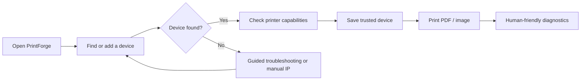
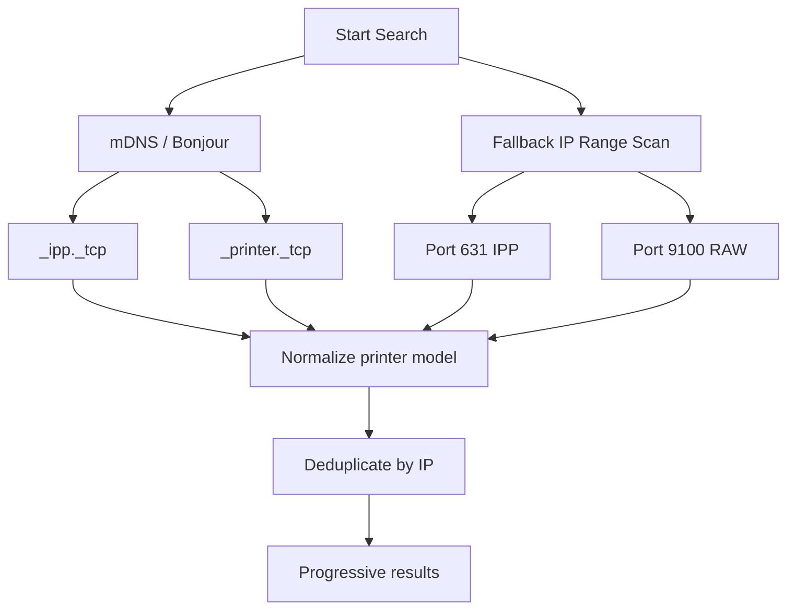
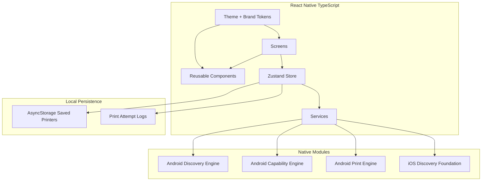
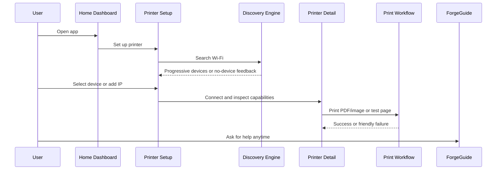

# PrintForge

<div align="center">

**Connect. Print. Scan. Simplified.**

PrintForge is a premium React Native mobile app for discovering printers and scanners on a local network, connecting with confidence, printing PDFs and images, and turning technical failures into calm, human guidance.

[](https://reactnative.dev/)
[](https://www.typescriptlang.org/)
[](https://www.nativewind.dev/)
[](#)

</div>

---

## The Vision

Printing should feel predictable.

Most printer apps expose users to ports, unreachable devices, confusing network behavior, and vague failures. PrintForge is designed to feel different: intelligent, calm, premium, and direct. It checks the network using multiple discovery strategies, saves trusted devices, detects what a printer can actually do, and explains problems in plain language.

PrintForge is free-first today, with foundations for future scan and fax support already shaped into the architecture.



---

## Product Experience

| Surface | What it does | Why it matters |
| --- | --- | --- |
| **Home Dashboard** | Shows setup, saved devices, available devices, print history, and ForgeGuide. | Users can start fast without a cluttered utility screen. |
| **Guided Printer Setup** | Lets users search Wi-Fi or add a printer by IP address. | Users are not forced into one discovery method. |
| **Discovery Dialog** | Blocks interaction during search, animates progress, and lists devices as they appear. | Search feels intentional instead of frozen. |
| **Printer Detail** | Displays status, capabilities, scanner readiness, diagnostics, and actions. | Users understand whether a printer is ready before printing. |
| **Print Workflow** | Selects PDF/JPG/PNG files, shows a basic preview, print options, and status feedback. | Printing feels like a simple guided task. |
| **Saved Devices** | Persists trusted printers with rename, remove, quick connect, and last-used behavior. | Returning users do not have to rediscover every time. |
| **ForgeGuide** | Offline assistant with quick questions, app knowledge, contextual answers, duplicate-send protection, and related follow-ups. | Help is available without being intrusive. |

---

## Brand System

PrintForge uses a dark, premium, calm visual language.

| Token | Value |
| --- | --- |
| Background | `#0F1115` |
| Surface | `#171A21` |
| Card | `#1E222B` |
| Border | `#2A2F3A` |
| Primary Text | `#E6E8EE` |
| Secondary Text | `#A0A6B2` |
| Muted Text | `#6B7280` |
| Gradient | `#F15FA5 -> #8B6CFF -> #4FA3FF` |
| Success | `#4ADE80` |
| Warning | `#FACC15` |
| Error | `#F87171` |

The app includes a temporary product-grade PrintForge mark and wordmark. The logo is wrapped in a reusable component so a final company logo can replace it later without touching the rest of the UI.

---

## What PrintForge Can Do Today

### 1. Discover Devices Reliably

PrintForge does not rely on one discovery path.



Discovery result shape:

```ts
type Printer = {
  id: string;
  name: string;
  ip: string;
  port: number;
  protocolHint: 'IPP' | 'RAW' | 'UNKNOWN';
  source: 'MDNS' | 'IP_SCAN' | 'MANUAL';
};
```

### 2. Detect Printer Capabilities

When a user selects a printer, PrintForge checks what is actually reachable.

| Check | Purpose | Timeout |
| --- | --- | --- |
| IPP on `631` | Standard printing readiness | 3 seconds |
| RAW on `9100` | Fallback direct socket printing | 3 seconds |
| HTTP / HTTPS | Future scan endpoint foundation | 3 seconds |

Capability result:

```ts
type PrinterCapabilities = {
  canPrint: boolean;
  supportedProtocols: Array<'IPP' | 'RAW'>;
  canScan: boolean;
  canFax: boolean;
  status: 'READY' | 'LIMITED' | 'UNREACHABLE';
  latencyMs: number;
};
```

### 3. Print PDFs and Images

PrintForge supports:

- PDF
- JPG
- PNG

Print protocols:

- **IPP mode**: sends jobs through HTTP POST with MIME-aware handling.
- **RAW mode**: sends file bytes directly through TCP port `9100`.
- **Retry behavior**: one retry for transient failures.
- **Failure handling**: offline printer, timeout, corrupted file, unsupported format, and unexpected printer response.

### 4. Explain Problems Like a Human

PrintForge converts technical failures into calm guidance.

| Technical state | User-facing language |
| --- | --- |
| No response | Printer is not accepting connections. Try restarting it. |
| Unreachable | Printer is offline or not on the same Wi-Fi network. |
| RAW only | Printer does not support standard printing. Using fallback mode. |
| High latency | Network is slow. Printing may fail or delay. |
| IP mismatch | Your phone and printer may be on different networks. |

### 5. Save and Manage Printers

Saved devices are stored with AsyncStorage:

```ts
type SavedPrinter = {
  id: string;
  name: string;
  ip: string;
  lastUsedAt: string;
};
```

Users can:

- Save a selected printer automatically.
- See saved devices instantly on app open.
- Tap a saved printer for quick connect.
- Rename a saved printer.
- Remove a saved printer.
- See which saved printer was used most recently.
- Recover when a saved printer IP changes by searching again or adding the new IP.

### 6. Ask ForgeGuide

ForgeGuide is a quiet offline assistant inside the app.

It can help with:

- Why a printer was not found.
- Manual IP setup.
- Wi-Fi and guest network issues.
- Saved devices.
- Printer status meanings.
- Test print flow.
- Scanner and fax foundation.
- App usage questions.

It also includes:

- Prepopulated quick questions.
- Duplicate quick-question protection.
- Contextual answers based on app state.
- Randomized related follow-up questions instead of repetitive copy.

---

## Architecture



Project structure:

```txt
PrintForge/
  src/
    components/       Reusable UI, logo, cards, assistant launcher, printer cards
    screens/          Home, setup, detail, print, assistant
    services/         Discovery bridge, capability checks, print service, diagnostics, assistant logic
    store/            Zustand printer state, persistence, print history
    utils/            Theme, brand, navigation, formatting
  android/            React Native Android app + Kotlin native modules
  ios/                React Native iOS app + discovery bridge foundation
  web-prototype/      Static branding prototype preserved for reference
```

---

## Native Engine Summary

| Engine | Platform | Status |
| --- | --- | --- |
| Printer Discovery | Android Kotlin | mDNS + throttled IP scan |
| Capability Detection | Android Kotlin | IPP, RAW, HTTP/HTTPS checks |
| Print Engine | Android Kotlin | IPP and RAW print submission |
| iOS Discovery | Swift bridge foundation | Ready for deeper discovery expansion |
| Shared UI / State | React Native TypeScript | Android and iOS ready |

---

## Step-by-Step Setup

### 1. Clone the repo

```sh
git clone git@github.com:mehtabhaumik/PrintForge.git
cd PrintForge
```

### 2. Install Node dependencies

Use Node `20.20.0` or newer.

```sh
npm install
```

### 3. Start Metro

```sh
npm run start
```

Keep Metro running in its own terminal.

---

## Run on Android

### 1. Prepare Android

Install:

- Android Studio
- Android SDK
- Android emulator or physical Android device
- JDK 17 or newer

The local SDK path belongs in `android/local.properties`, which is intentionally ignored by git.

Example:

```properties
sdk.dir=/Users/your-name/Library/Android/sdk
```

### 2. Launch Android

```sh
npm run android
```

### 3. Build Android manually

```sh
cd android
./gradlew :app:assembleDebug
```

The debug APK is generated under:

```txt
android/app/build/outputs/apk/debug/
```

---

## Run on iOS

### 1. Prepare iOS

Install:

- Xcode
- CocoaPods
- iOS simulator or physical iPhone setup

### 2. Install pods

```sh
cd ios
pod install
cd ..
```

### 3. Launch iOS

```sh
npm run ios
```

---

## Verify the Project

Run the core checks before pushing changes:

```sh
npm run typecheck
npm run lint
npm test -- --runInBand
```

Recommended Android build check:

```sh
cd android
./gradlew :app:assembleDebug
```

---

## User Journey



---

## Free-First Product Opportunities

PrintForge can be offered free while still creating long-term product value:

- Build trust with reliable discovery and clean troubleshooting.
- Keep saved devices and print history local-first.
- Add scan support behind the existing HTTP/eSCL foundation.
- Add richer print settings over time.
- Add diagnostics intelligence from local attempt patterns.
- Introduce optional premium features later without weakening the free core.

---

## Roadmap

| Area | Direction |
| --- | --- |
| iOS Discovery | Expand Bonjour and IP scan parity with Android. |
| Scanner Workflow | Build eSCL detection, scan preview, and document export. |
| Fax Foundation | Detect future fax-capable endpoints and define UI. |
| Print Options | Add duplex, page range, paper size, orientation, and quality. |
| Diagnostics | Use local pattern history to suggest better next steps. |
| Assistant | Add deeper contextual flows while staying offline-first. |
| App Icon | Replace the temporary PrintForge mark with final company branding. |

---

## Design Principles

- **Calm first**: no panic language, no raw technical errors.
- **Multiple paths**: search Wi-Fi, add IP, use saved devices.
- **Progressive feedback**: show what is happening while networks respond.
- **No vendor lock-in**: no printer vendor SDK dependency.
- **Future-ready**: scanning and fax are planned into the structure, not bolted on later.
- **Premium utility**: practical app behavior with polished mobile interaction.

---

## Current Notes

- Android has the deepest native implementation today.
- iOS scaffolding and discovery bridge are present, with deeper parity planned.
- Real printer behavior varies by model, firmware, network isolation, router settings, and sleep state.
- `web-prototype/` is a preserved branding prototype and not part of the React Native bundle.

---

## License

Private project unless a license is added.
